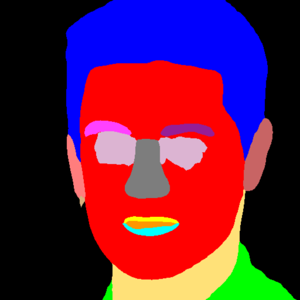

# Face feedback with RunwayML

.

Quick experiment to try and drive one model output as an input to another and back.

Takes an initial face:

Use Face-Parser inside Runway to segment to face parts:

And now feed the segmentation into SPADE-FACE to turn them back into a "real" face, that you can send back again to Face-Parser.

## Requirements

Install [RunwayML](https://runwayml.com/).

You'll need to have both models (Face-Parser and SPADE-FACE) running, and make note of their server addresses (in the Network tab) and change it in sketch.js if you need to.

As you can see from the animation above, the face gets lost very quickly, and the pair struggle to regain it.

## TODO

Worth trying with different initial faces, or with any other matching pair of algorithms
